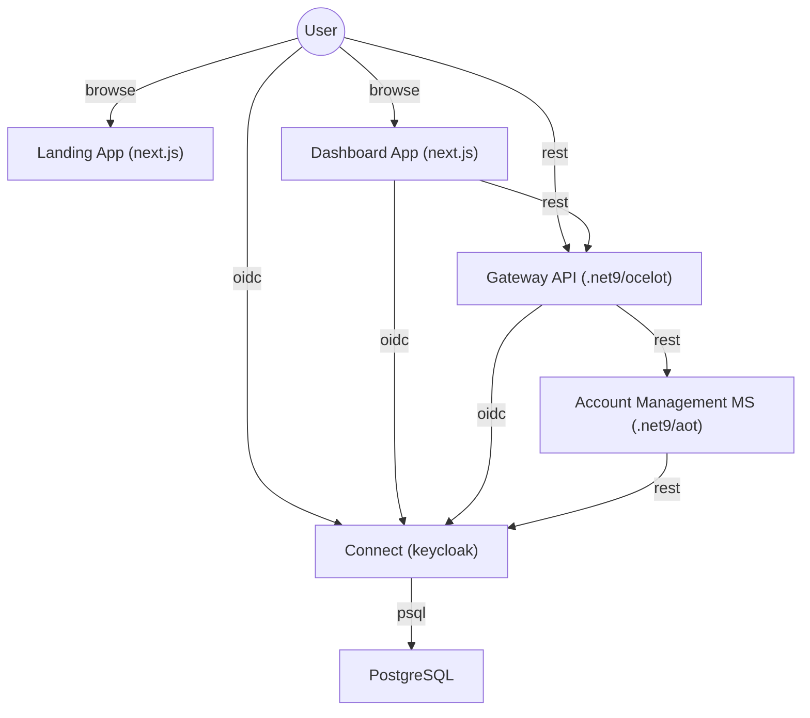
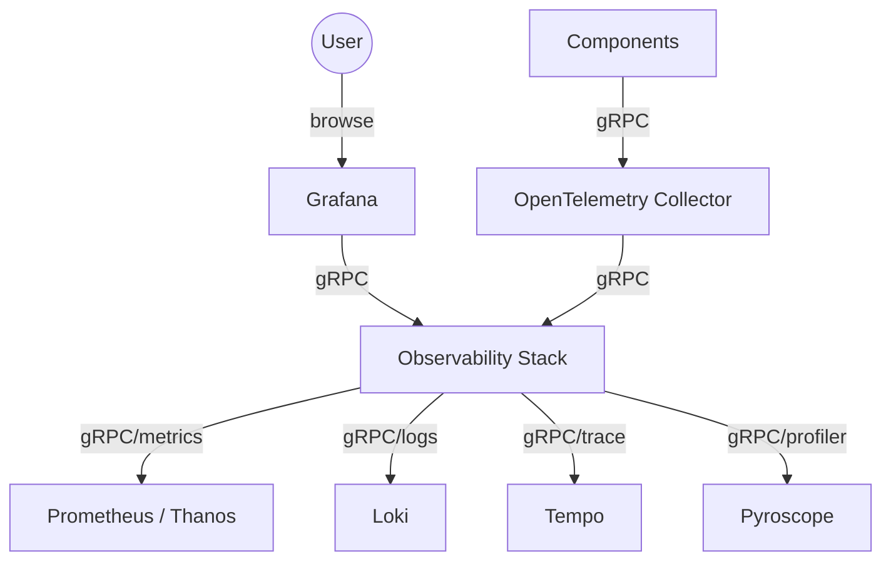

# m8te.ai

```bash
cd m8te.ai
```

## What is it?

```bash
cat description.txt
```

**M8te.ai** is a cutting-edge, secure chatbot solution that lets you query any type of data—whether it's databases, text files, or other sources—using natural language. It offers a flexible, model-selecting interface while ensuring your sensitive data stays on-site through localized, agent-based processing. Embrace your smart data companion with M8te.ai!


## Components

```bash
cat components.diagram
```



## Observability

```bash
cat observability.diagram
```

